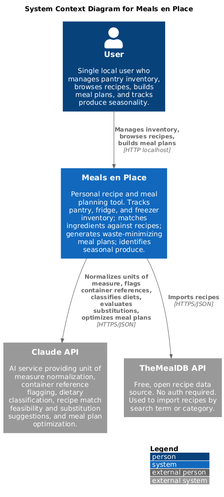
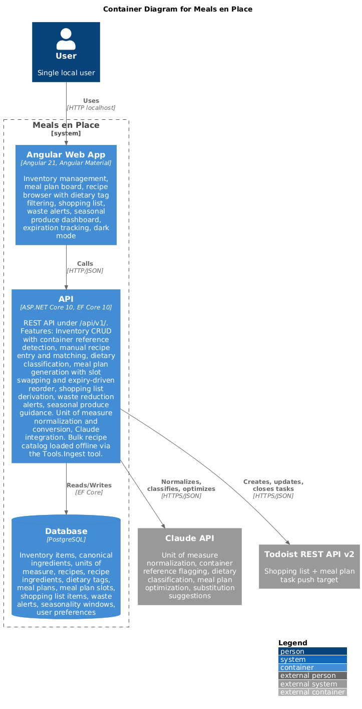
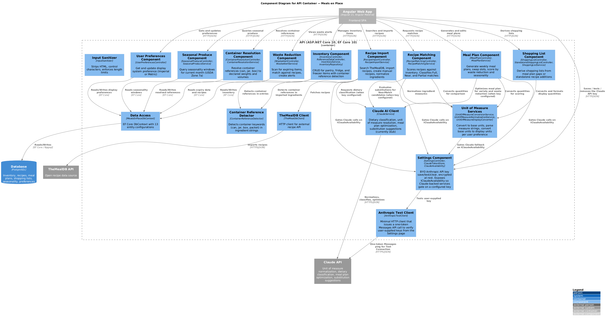
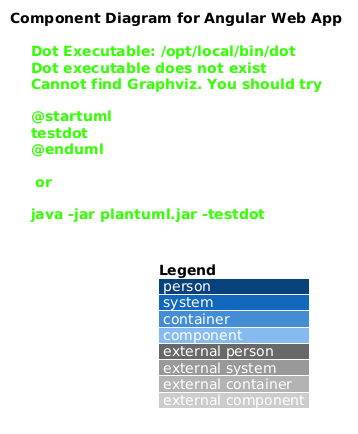

# Meals en Place

A personal recipe and meal planning tool that tracks pantry, fridge, and freezer inventory; matches available ingredients against a local recipe library; generates meal plans that minimize waste; and identifies what produce is in season. Single-user, local deployment.

## Tech Stack

- **API:** ASP.NET Core 10, Entity Framework Core 10, PostgreSQL
- **Frontend:** Angular 21, Angular Material, PWA (service worker, offline support)
- **AI:** Claude API (dietary classification, ingredient normalization, meal plan optimization)
- **External APIs:** TheMealDB (recipe data), Open Food Facts (ingredient metadata)
- **Testing:** xUnit, FluentAssertions, Moq

## Getting Started

### Prerequisites

- [.NET 10 SDK](https://dotnet.microsoft.com/download)
- [Node.js 22+](https://nodejs.org/)
- [Docker Desktop](https://www.docker.com/products/docker-desktop/)

### Setup

```bash
# Start PostgreSQL
docker compose up -d

# Apply database migrations
dotnet ef database update --project src/MealsEnPlace.Api

# Start the API (HTTPS on port 7274)
dotnet run --project src/MealsEnPlace.Api --launch-profile https

# In a separate terminal, start the frontend (HTTPS on port 4280)
cd src/MealsEnPlace.Web
npm install
ng serve
```

Open `https://localhost:4280` in your browser.

Swagger docs are available at `https://localhost:7274/swagger`.

### Running Tests

```bash
dotnet test
```

## Project Structure

```
src/
  MealsEnPlace.Api/          # ASP.NET Core Web API
    Common/                   # Shared types, UOM conversion/normalization, container detection
    Features/
      Inventory/              # Inventory CRUD, reference data endpoints
      MealPlan/               # Meal plan generation, slot swapping
      Recipes/                # Recipe import, matching, container resolution, dietary tags
      SeasonalProduce/        # Seasonal produce guidance (Zone 7a)
      ShoppingList/           # Shopping list derived from meal plan vs inventory
      WasteReduction/         # Waste alerts for expiring items with recipe suggestions
    Infrastructure/
      Claude/                 # Claude API client (stub) and prompt types
      Data/                   # EF Core DbContext, migrations, configurations
      ExternalApis/           # TheMealDB and Open Food Facts clients
    Models/Entities/          # Domain entities and enums
  MealsEnPlace.Web/           # Angular 21 frontend
    src/app/features/
      inventory/              # Pantry/Fridge/Freezer management
      expiration/             # Upcoming expiration dates view
      meal-plan/              # Weekly meal plan board with generate/swap
      recipes/                # Recipe browser, import, matching, dietary filters
      seasonal-produce/       # In-season produce list (Zone 7a)
      shopping-list/          # Shopping list from meal plan gaps
      waste-alerts/           # Expiry alerts with recipe suggestions
    src/app/core/             # Shared services and models
    src/app/shared/           # Reusable UI components (offline banner)
tests/
  MealsEnPlace.Unit/          # Unit tests (219 tests)
  MealsEnPlace.Integration/   # Integration tests (18 tests, WebApplicationFactory)
docs/
  backlog.md                  # Product backlog (MEP-001 through MEP-024)
  c4/                         # PlantUML C4 architecture diagrams (L1–L3)
```

## Architecture

C4 diagrams below are rendered from [docs/c4/](docs/c4/) on every push to `main` that touches a `.puml` file (see [.github/workflows/render-c4.yml](.github/workflows/render-c4.yml)). The `.puml` sources remain the source of truth; the `.png` files are generated artifacts.

### Level 1 — System Context


### Level 2 — Containers


### Level 3 — API Components


### Level 3 — Web Components


## Implemented Features

- **Inventory Management** (MEP-001) -- Track items across Pantry, Fridge, and Freezer with quantity, UOM, and expiry dates
- **UOM Normalization** (MEP-002) -- Convert between units; Claude resolves colloquial measures
- **Container Reference Resolution** (MEP-003) -- Detect "1 can", "1 jar" and prompt for actual weight/volume
- **Recipe Import** (MEP-004) -- Import from TheMealDB by name, cuisine, or category
- **Dietary Classification** (MEP-005) -- Rule-based dietary tagging (Vegetarian, Vegan, GlutenFree, etc.) with library filtering
- **Recipe Matching** (MEP-006) -- "What can I make?" ranked by ingredient coverage with waste bonus and dietary tag filters
- **Meal Plan Generation** (MEP-007) -- Weekly plans optimized for waste reduction, seasonal affinity, and variety; manual slot swapping
- **Shopping List** (MEP-008) -- Auto-generated from meal plan ingredient needs vs current inventory
- **Waste Alerts** (MEP-009) -- Surfaces expiring items with matching recipe suggestions; dismiss support
- **Seasonal Produce** (MEP-010) -- USDA Zone 7a in-season produce list with full calendar view
- **Upcoming Expiration Dates** (MEP-015) -- Dashboard view of items approaching expiry
- **Material Icons** (MEP-016) -- Edit and delete icons in inventory table
- **Dark Mode** (MEP-017) -- Theme toggle with OS preference detection and localStorage persistence
- **User-Controlled Display Unit** (MEP-022) -- Inventory items display in their entry unit, not auto-converted
- **Input Sanitization** (MEP-023) -- HTML stripping, control char removal, length enforcement across all inputs
- **Progressive Web App** (MEP-021) -- Installable on mobile, offline caching, responsive sidenav, push notification stubs
- **Automated C4 Diagram Rendering** (MEP-024) -- GitHub Actions workflow renders `docs/c4/*.puml` to PNG on every push, commits the artifacts, and uploads them for 7-day download

## License

See [LICENSE](LICENSE) for details.
